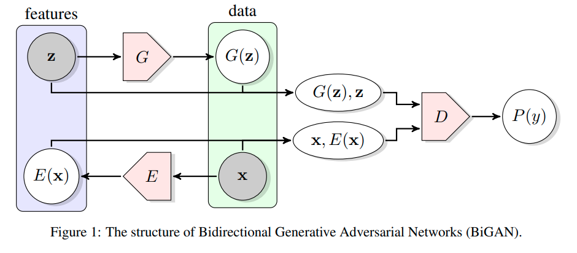

## Adversarial Feature Learning

文章思考：普通的GAN将简单的数据分布映射到复杂的数据分布中，并在latent code中有了语义的表达，但是却没有一个相反的流程将复杂数据转换到语义的隐变量中。如果可以 那么可以使用GAN作为无监督学习的手段学习到数据中更多有用的信息。

因此针对上面的问题提出了BiGAN Bidirectional Generative Adversarial Network

判别器需要判断的是 $z$ 和 $G(z)$的联合概率分布 通过理论可以证明 E恰好 是G的逆运算

当然 学习一个decoder 可以用较为传统的思路 在已有的GAN的数据下 给定$G(z)$ 预测 $z$

即学习一个隐变量的回归器

在ImageNet 上的表现

可以捕捉到有趣的信息

