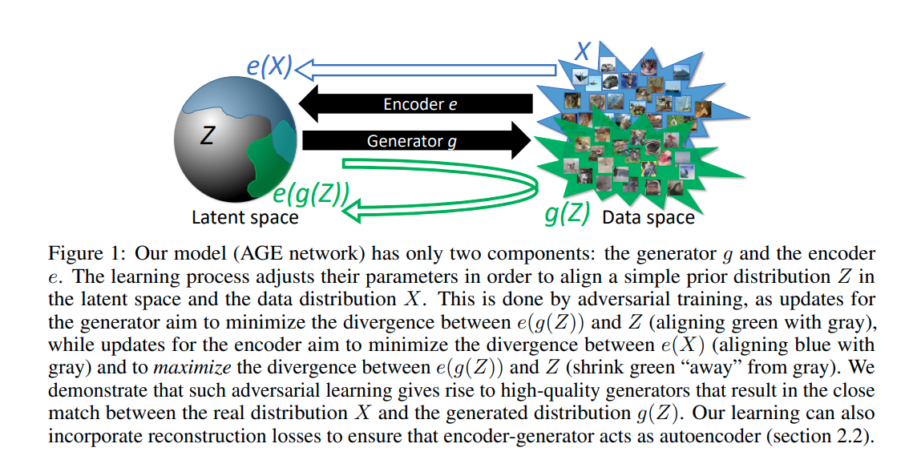

## Adversarial Generator-Encoder Networks

github:  https://github.com/DmitryUlyanov/AGE

AGE 主要是在隐式空间中比较 真实数据和生成数据分别与先验的divergence 

**文章动机**：

在之前的GAN VAE hybrid 的模型里面 需要至少三个component  encoder decoder 和discriminator 效率和训练难度 较大

而这篇文章提出 只在encoder 和decoder 之间完成对抗训练

VAE 和GAN 分别是最流行的深度生成的方法，他们的优势与缺点恰好互补

VAE 学习了一个 bidirectional mapping  between  a complex data distribution and a much simpler prior distribution , 而 GAN 学习了一个unidirectional mapping only allows sampling the data distribution, use a more complex loss functions can generate more realistic samples

为了结合 这两种方式之间的优势 hybrid方法 一般会包含 encoder\decoder\discriminator  三个组件

如 BiGAN ALiI AAE 

通常是 利用对抗思想 在latent space\data space\joint space 去align distribution 

但是 AGE 这篇文章表示不需要增加模型的复杂性依然可以结合 GAN和VAE的优点

AGE 的objective 是 比较 的 真实数据 在隐空间中的分布 和 生成数据在隐空间中分布的divergence 

***The AGE learning process then considers the divergence of each of these two distributions to the original prior distribution.***

隐空间中的分布散度减小代表数据空间的对齐

但是上述目标并不能保证encodr 和generator 之间的reciprocity 

reciprocity 的含义是指  $x = g(z)$ 当 $z = e(x)$

因此还需要加入 reconstruction loss

同样选取了 在latent space 之间的reconstruction loss

主要的对抗方法发生在 latent code space:

1. 在更新 generator 的时候 主要致力于减少$e(g(z))$ 和$z$ 分布之间的散度
2. 在更新 encoder 的时候  主要致力于减少$e(g(z))$ 和 $e(x)$分布之间的散度 同时 还要增大$e(g(z))$和 $z$之间的散度

和GAN 一样运用了对抗思想 但是衡量尺度是发生在隐空间中 因此不需要额外的 discriminator 去度量分布之间的差异 这点在ALAE 文章中也有阐述

但是 文章是如何在隐空间中度量散度的呢

和VAE中充当正则化项的散度不同  散度是通过在batch-level 中计算的 

***The divergences within AGE training are also computed as batch-level statistics.***

同时研究了image colorization 的问题

其他prevent mode collapse 的方法 也包括利用batch-level信息和 将classifying discriminator 替换成regression-based one  如 energy-based GAN 或WGAN

后面实验比较了 ALI 和  AGE的效果 可以证明 AGE 相对ALI 提升了不少效率 因为架构中没有discriminator 同时 也证明了 在隐空间中使用简单的先验和散度是可以产生较好质量的图片的。

同时在 conditional experiment 中 研究了给图片上色的问题  架构细节有待继续研究

Image colorization  which is hard for GAN

