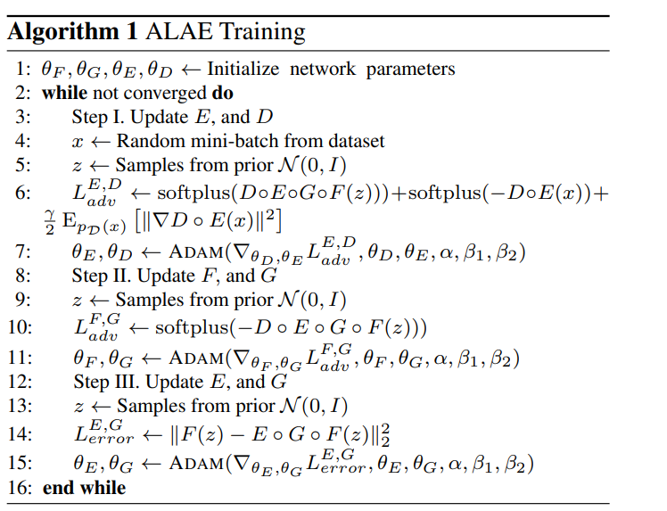
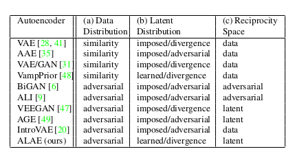

### Adversarial Latent Autoencoders

文章开始就说了 VAE 研究的两个热点分别是：

1. same generative power of GANs
2. learn disentangled representations

同时目前关于VAE的文章都有一个共同的假设:

the latent space should have a probability distribution that is fixed a priori and the autoencoder should match it.

从以上观察中 构建出了一个新方法

allow the latent distribution to be learned from data to address entanglement

the output data distribution is learned with a adversarial strategy 

具体的architecture 如下：

整个模型的objective 是：
$$
 min_{F,G}max_{E,D}V(G\circ F,D\circ E)  + min_{E,G}\Delta(F||E\circ G \circ F)
$$

**training producer**

通过 adversarial 的方式学习data distribution 同时 $\Delta(p||q)$ 表示discrepancy between two distributions $p$ and $q$

在  data distribution\ latent distribution\ Reciprocuty space 和其他approch 的区别

ALAE 通过对抗的方式学习data distribution  

并且latent distribution 是学习得到的 并没有一个impose 的先验

reciprocity space 选择了 latent 
$$
\Delta(F||E\circ G\circ F) = E_{p(z)}[\| F(z)-E\circ G\circ F(z)\|_{2}^{2}]
$$
在latent space 使用$L_{2}$ norm 并没有十分重要的影响 因为不是像素空间

## need read other literature  VampPrior