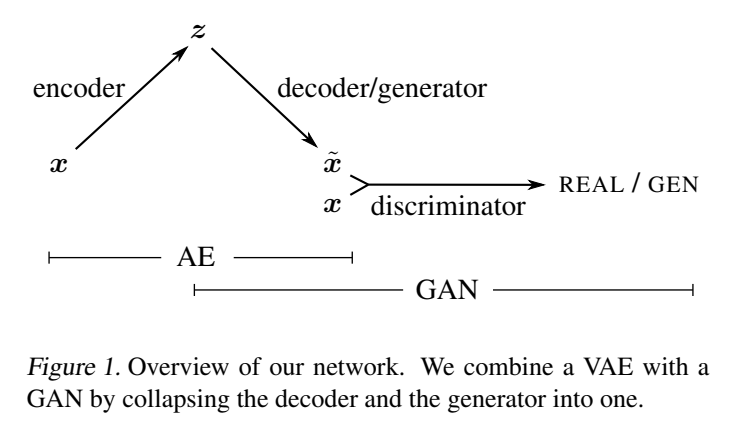

## Autoencoding beyond pixels using a learned similarity metric

*问题是 如何学习 similarity metric*

在数据空间中如何用更好的相似性测量手段 如何应用到autoencoder当中

>  combining a variational autoencoder with a generative adversarial network we can use learned feature representations in the GAN discriminator as basis for the VAE reconstruction objective

本文思路主要由上面一句话总结 具体怎么做还要继续看

所以 传统vae 基于像素尺度的error被基于feature特征尺度的error所取代

使用一个更高层次拥有足够不变性的表示去衡量相似性

相比手动设计一个这样的函数 学习到一个这样的函数会更加适合

问题是如何学到这样一个function 本文发现如果联合训练一个VAE 和GAN 那么GAN中的discriminator measure sample similarity 

*collapse the VAE decoder and the GAN generator into one*

