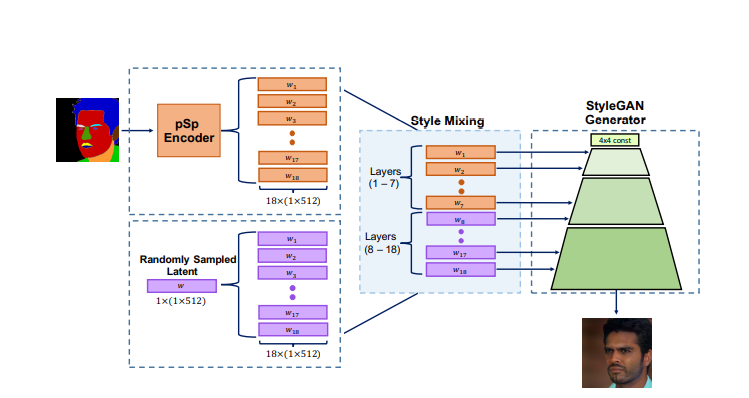

### Encoding in Style: a StyleGAN Encoder for Image-to-Image Translation

**Abstract**

> Our pSp framework is based on a novel encoder network that directly generates a series of style vectors which are fed into a pretrained StyleGAN generator, forming the extended W+ latent space. We first show that our encoder can directly embed real images into W+, with no additional optimization.

`utilizing encoder to directly solve image-to-image translation tasks, defining them as encoding problems from input domain into the latent domain.`

*Two Questions:*

***what's the definition of the $w$+ space, and the difference between $w$+ and $w$ in StyleGAN?***

***how to generates style without additional optimization?***

_as inverting a real image into a 512-dimensional vector w does not lead to an accurate reconstruction.
Motivated by this, it has become common practice to encode real images into an extended latent space, W+, 
defined by the concatenation of 18 different 512-dimensional w vectors, one for each input layer of StyleGAN._ 

These works usually resort to using per-image optimization over W+, a fast and accurate inversion of real image into W+ is a challenge.

**Models**

for StyleGAN, we further define $\bar w$ to be the average style vector of the pre-trained generator.

the output of the model:
$$
pSp(x) := G(E(x)+\bar w)
$$

loss function

pixel-wise $L_{2}$ loss
$$
L_{2}(x) = \left\| x-pSp(x)\right\|^{2}
$$

LPIPS Loss
$$
L_{LPIPS}(x) = \left\| F(x)- F(pSp(x))\right\|^2
$$
to encourage the encoder to output latent style vectors closer to the average latent vector

regularization Loss:
$$
L_{reg} = \left\| E(x)-\bar w\right\|^2
$$
recognition loss for facial images
$$
L_{ID} = 1 - <R(x),R(pSp(x))>
$$
where the R is the pre-trained Arcface network

total loss function is defined as
$$
L(x) = \lambda_{1}L_{2}(x)+\lambda_{2}L_{LPIPS}(x)+\lambda_{3}L_{ID}(x)+\lambda_{4}L_{reg}(x)
$$

style-mixing in training 

()

**Applications and Experiments**

- Inverson

- face frontalization, first randomly flip the target image during training , next increase the $L_{ID}$ and decrease $L_{2}$ and  $L_{LPIPS}$

