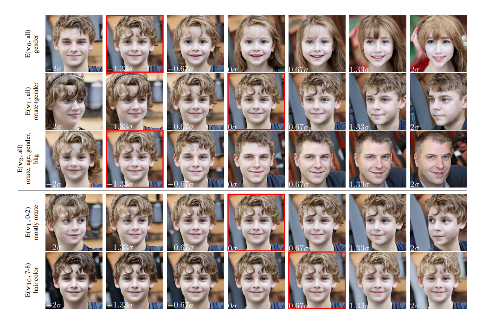
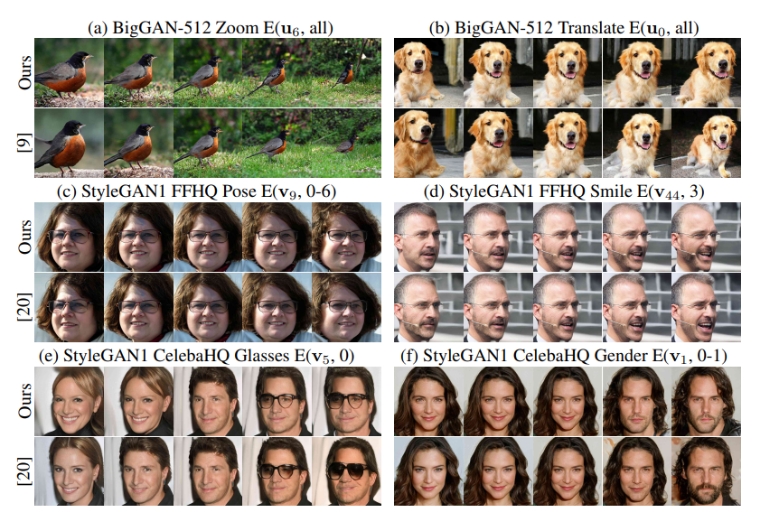

## GANSpace: Discovering Interpretable GAN Controls

> we identity important latent directions based on **Principal Component Analysis (PCA)** applied on either in latent space or feature space, a large number of interpretable controls can be defined by layer-wise perturbation along the principle directions

 ***Two discoveries***:

- important directions can be found by applying Principal Component Analysis in latent space for StyleGAN and feature space for BigGAN
- BigGAN can be modified to allow  StyleGAN-like layer-wise style-mixing and control without retraining

how to find useful directions in $z$ space? As the isotropic prior distribution $p(z)$ does not indicate which directions are useful.

> the principal components of feature tensors on the early layers of GANs represent important factors of variation

**For StyleGAN**

> we sample N random vectors $z_{1:N}$ , and compute the corresponding $w_{i} =  M(z_{i})$ values. We then compute PCA of these $w_{1:N}$ values. This gives a basis $V$ for $W$

Given a new image defined by $w$, we can edit by varying PCA coordinates $x$ before feeding to the synthesis network:
$$
w' = w + Vx
$$
where each entry $x_{k}$ of $x$ is a separate control parameter.

**For BigGAN**

> we instead perform PCA at an intermediate network layer $i$, and then transfer these directions back to the $z$ latent space 

compute PCA at the first linear layer of BigGAN512-deep 

***Result***

first few principal components are shown that they capture important concepts, some of them entangle several separate concepts 

**GAN and PCA properties**

- across major of models, large-scale changes to geometric configuration and viewpoint are limited to the first 20 principal components ($v_{0}-v_{20}$); successive components leave layout unchanged, and instead control object appearance/background and details.

- StyleGAN_V2's latent distribution $p_{w}$ has a relatively simple structure, the first 100 principle components are sufficient to describe overall image.

  

**VS. Supervised methods**

pros: unsupervised, be able to identity many edits that have not previously been demonstrated

cons: a tendency for slightly more entanglement
