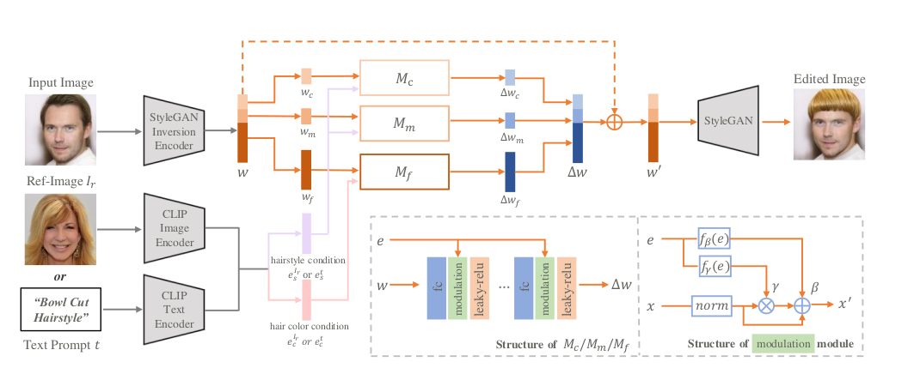
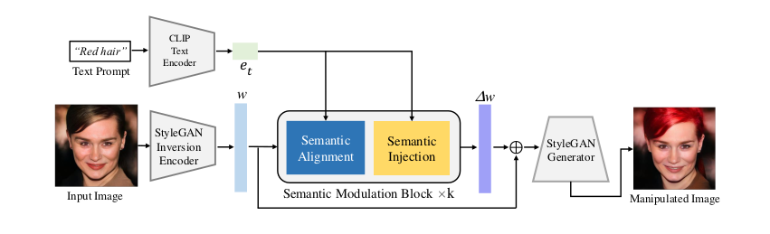
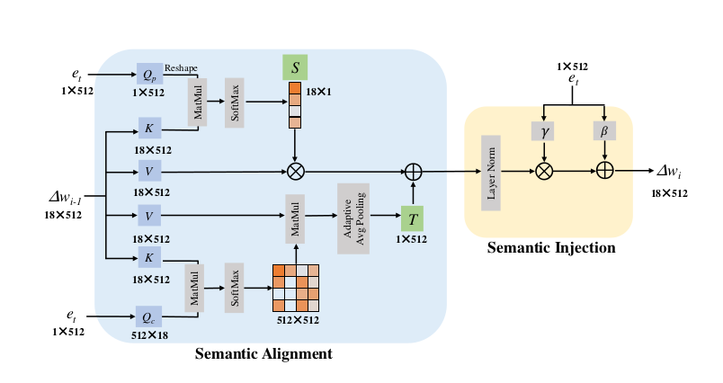

### HairCLIP && FFCLIP

> HairCLIP: Design Your Hair by Text and Reference Image
>
> One Model to Edit Them All: Free-Form Text-Driven Image Manipulation with Semantic Modulations

these two model are based on the StyleCLIP, 

cause in the second method called Latent Mapper in  StyleCLIP paper, model is trained for every single text prompt, therefore we need train multiple Mappers for corresponding text prompts.

### HairCLIP 

In the HairCLIP the hair style embedding from CLIP and color embedding are feed into the model simultaneously. 

new designs:

1. *Shared Condition Embedding*, leverage the text encoder and image encoder of CLIP to extract their embedding as the conditions for the mapper network respectively.
2. *Disentangled Information Injection*, style and color embedding are feed into different sub mapper
3. *Modulation Module*. a conditional modulation module to accomplish the direct control of input conditions on latent codes.

in HairCLIP the loss consists of three part:

**Text Manipulation Loss**:
$$
\mathcal{L}_{t} = \mathcal{L}_{st}^{clip}+ \mathcal{L}_{ct}^{clip}
$$
for hairstyle text manipulation loss the cosine distance between the manipulated image and the given text in the CLIP latent space
$$
\mathcal{L}_{st}^{clip} = 1-\cos(E_{i}(G(w+M(w,e_{s}^{t},e_{c}))))
$$
the $e_{c} \in \{e_{c}^t, e_{c}^{lr},0\}$, $E_{i}$ represents the image encoder of CLIP

**Image Manipulation Loss**:
$$
\mathcal{L}_i = \lambda_{si}\mathcal{L}_{si}+\lambda_{ci}\mathcal{L}_{ci}
$$
where $\lambda_{si},\lambda_{ci}$ are set to 5,0.02 respectively by default.

given a reference image, we need the manipulated image to have the same style as that of the reference image.
$$
\mathcal{L}_{si} = 1-\cos (E_{i}(x_{M}*P_{h}(x_{M})),E_{i}(x*P_{h}(x)))
$$
$P$ denotes the pretrained facial parsing network, and $P_{h}(x_{M})$ represents the mask of the hair region.

the color loss is defined by the average color difference in the hair region.
$$
\mathcal{L}_{ci} = \|avg(x_{M}*P_{h}(x_{M}))-avg(x*P_{h}(x))\| _{1}
$$

**Attribute Preservation Loss**:

to ensure identity consistency before and after manipulation. the identity loss is applied as follows:
$$
\mathcal{L}_{id} = 1- \cos(R(G(w+M(w,e_s,e_c))),R(G(w)))
$$
R denotes a pretrained **ArcFace** network

### FFCLIP

FFCLIP manipulates one image according to different semantic text prompt. FFCLIP consist of several semantical modulation blocks. Each block has one *semantic alignment* and *semantic injection* module.

the innovation in this paper is the new designed Semantic Alignment, while lack of reasonability.

the semantic alignment module regards the text embeddings as the query, the latent code $w$ as the key and the value.

the loss objective consist of two parts:

**Semantic Preserving Loss**

as the image subject is consistent, the distance between these two embeddings should be small.
$$
\mathcal{L}_{embd} = 1-\cos(E_{I}^{CLIP}(G(w')),E_{I}^{CLIP}(G(w)))
$$

$w' = w+\Delta w$
$$
\mathcal{L}_{norm} = \|\Delta w\|_{1}
$$
identity loss is same as in HairCLIP
$$
\mathcal{L}_{id} = 1- \cos(R(G(w')),R(G(w)))
$$
**Text Manipulation Loss**

to evaluate the correlation between output image and text prompt embeddings, to minimize cosine distance by using CLIP model.

$$
L_{t} = 1-\cos(E_{I}^{CLIP}(G(w')),e_{t})
$$

total loss is 
$$
\mathcal{L}_{total} = \lambda_{sp} \cdot L_{sp}+\lambda_{t} \cdot L_{t}
$$
