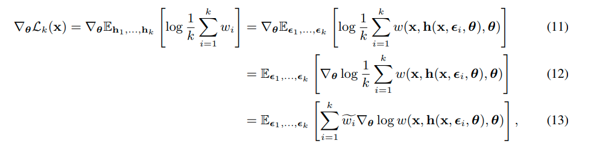

### IMPORTANCE WEIGHTED AUTOENCODERS

一篇较早期的vae的文献

针对VAE后验不够灵活的手段，recognition network use multiple samples to approximate the posterior, improved the test log-likelihood on density estimation benchmarks

一般来说 对于 一般的VAE 使用monte carlo estimator:
$$
\frac{1}{k}\sum_{i=1}^{k}\nabla_{\theta}logw(x,h(\varepsilon_{i},x,\theta),\theta)
$$
with $w(x,h,\theta) = p(x,h|\theta)/q(h|x,\theta)$ 

对于 IWAE 来说 目标函数更改为了
$$
\nabla_{\theta}log\frac{1}{k}\sum_{i=1}^{k}w(x,h(\varepsilon_{i},x,\theta),\theta)
$$
将求和公式带入到log内部，简化后 

其中 $\tilde{w_{i}} = w_{i}/\sum_{i=1}^{k}w_{i}$

也即是 在采样中 拥有更高概率的采样点权重更大， 最后 文章在
MNIST数据集中验证了 density estimation 和 activate unit 

如何定义 activate units？ 看文章吧 通过协方差来判断

