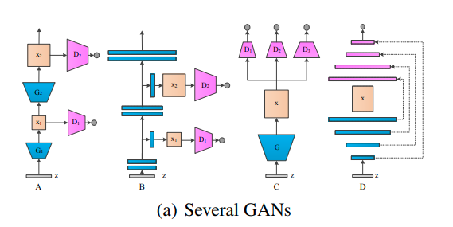

## IntroVAE

IntroVAE 当中intro的含义 introspective 自省 通过引入对抗训练 align data distribution 和generated samples

首选分析了普通GAN生成高分辨率图片时的策略 通过多个discriminator或在堆栈式的结构去align不同层次的特征:

如常见的架构有：

同时 在VAE 结合GAN 的方面 有如下文章

1. VAE/GAN: use a discriminator on data space to improve the quality of the results generated by VAE
2. AAE: discriminates in latent space to match the posterior and prior distribution 这篇文章 优点在于可以使用隐式的分布作为先验 从中采样即可不用知道close form
3. ALI 和BiGAN 使用判别器 对齐 latent code和data 的联合分布
4. VeeGAN 在ALI 和BiGAN 的基础上对 latent space 做了约束 希望可以减少mode collapse

