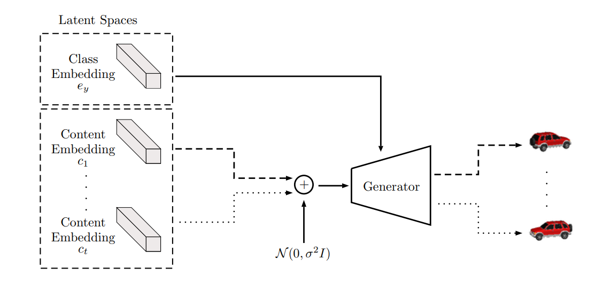
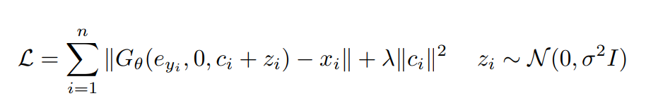
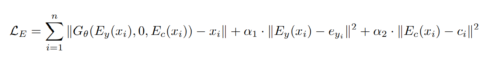

## LORD (Latent Optimization for Representation Disentanglement)

a model to disentangle the hidden factors of variations

*disentangling class and content representations assumes that intra-class variation is significantly lower than inter-class variation.*

**lord do not give any explicit constraint to the latent, so it can not generate new sample, but the disentanglement is outperform any other method.**

*what is inductive bias?*

a non-adversarial method to class and content disentanglement

there are two stage for this method:

##### the first stage:

use latent optimization for class supervision( not the amortized inference)

all class embeddings and content embeddings, and the generator are jointly optimized.

class embedding and content embedding are from latent optimization

##### second stage :

use a forward network to learn the image latent code mapping

#### Article highlights

1. ##### latent optimization

   different from the previous method, LORD do not leverage the amortized technology, the benefit of latent optimization is 

   **a.** as the class code is shared exactly between all images belonging to the same class, it is impossible to introduce any content information in the class code

   **b.**  there is no any constraint in training procedure compare with the previous approach

2. #####  Asymmetric Noise Regularization

   > Latent optimization over the class embeddings ensures that no content information is present in the class representation. To ensure that class information does not leak into the content representation, we regularize the content code to enforce minimality of information

   for content encoder, in contrast to variational auto-encoder, LORD do not learn the variance, but rather keep it fixed. this prevent the possibility of the variance decreasing  to a small value, ensuring that noise is applied equally on all components. 

   the shortcoming of this approach is can not generate new sample as lacking prior regularization

