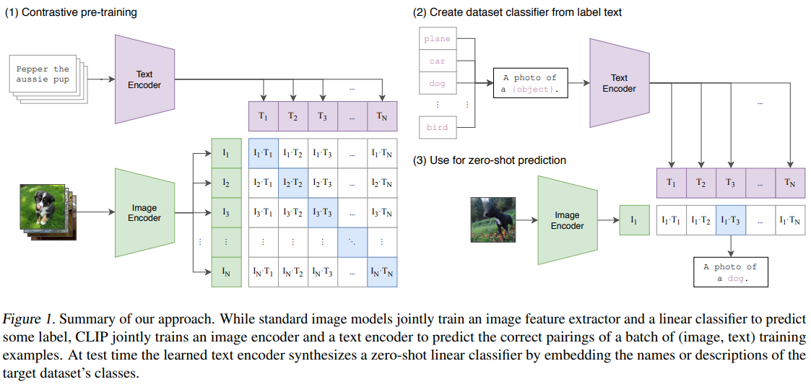
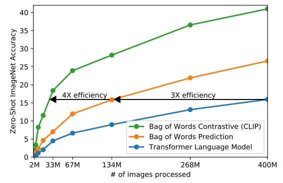

### Learning Transferable Visual Models From Natural Language Supervision (CLIP)

> We demonstrate that the simple pre-training task of predicting which caption goes
> with which image is an efficient and scalable way to learn SOTA image representations 
> from scratch on a dataset of 400 million (image, text) pairs collected from the internet

### Summary of CLIP
The core of approach is the idea of learning perception from supervision contained in natural language.
_deep contextual representation learning_ is used as the tool to encode natural language.

as generative models acquires over an order of magnitude more compute than contrastive models with
the same performance.
> Noting these findings, we explored training a system to solve the potentially easier proxy task 
> of predicting only which text as a whole is paired with which image and not the exact words of that text.
 
