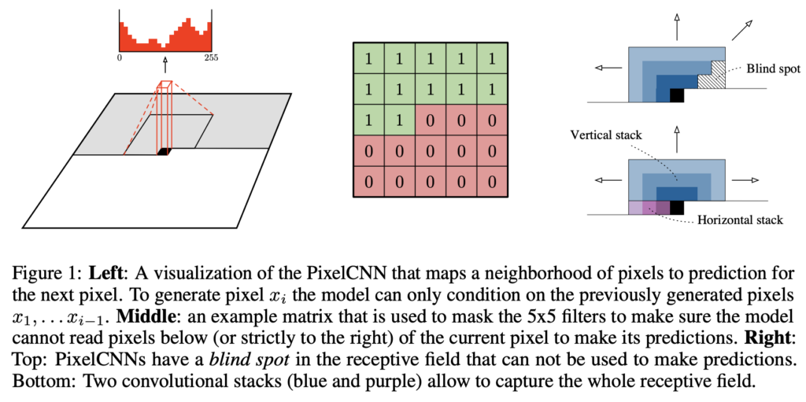
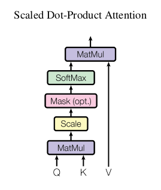
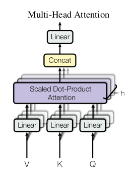

## PixelSNAIL: An Improved Autoregressive Generative Model

本文反思之前的ar模型，以及当时meta reinforcement learning 的经验 处理长程依赖是重要的，因此决定将

causal convolutions 和 self attention 结合在一起改进ar模型。结果证明可以取得当时高维数据密度估计的最好成绩

疑问点

1. causal convolutions 是什么
2. self attention 又是什么

causal 和 之前的GatedMaskedConv2d 有啥联系和区别

pixelCNN (pixelRNN) model joint distribution:
$$
p(x) = \prod_{i=1}^{n^{2}} p(x_{i}|x_{1},...,x_{i-1})
$$
为了体现出 像素之间的有序性，当前像素只受左边像素和上方像素影响，因此加入了对filters 加入掩膜

称为 maskedconv，

对于每个像素的各个通道，也是对RGB三个通道进行依次建模，pixelCNN 接受的M×N×3 作为输入，以M×N×3×256 作为输出，即输出描述多项式分布，同时对输出进行采样的时候，也需要进行序列化的取值。

这种建模方式可以产生高质量的图片，同时也可以将像素值看成是离散非线性或者线性的

pixelRNN的效果要好于pixelCNN，原因大概有二：

1. LTSM拥有更加长程的感受野
2. LTSM复杂的门可以拟合更加复杂的结构

为了解决更加复杂的unit，将maskconv之间的整流线性单元relu替换为：
$$
y=tanh(W_{k,f}\ast x) \odot \sigma(W_{k,g}\ast x)
$$

为了解决感受野产生的盲点 即上图的blind spot

将filter拆分成两部分  horizontal 和 vertical 部分

水平部分只关注该行左侧部分，而vertical部分关注像素所在行以上的所有像素，但是在github中 所有的GatedMaskedConv2d 的实现好像都没有使用图片的尺寸n来作为filter_size，包括wikiped 的示意图也有相关问题

什么是self-attention

NML领域对seq2seq+attention早有相关架构，之后的self attention(Attention Is All You Need)transfomer 表现却十分优异

https://lena-voita.github.io/nlp_course/seq2seq_and_attention.html 

Attention Is All You Need 这篇文章中对attention的定义：

An attention function can be described as mapping **a query and a set of key-value pairs to an output**,
where the query, keys, values, and output are all vectors**. The output is computed as a weighted sum**
**of the values, where the weight assigned to each value is computed by a compatibility function of the query with the corresponding key.**

具体有以下两种attention

Scaled Dot-product attention
$$
Attention(Q,K,V) = softmax(\frac{QK^T}{\sqrt{d_{k}}})V
$$

Multi-Head Attention

