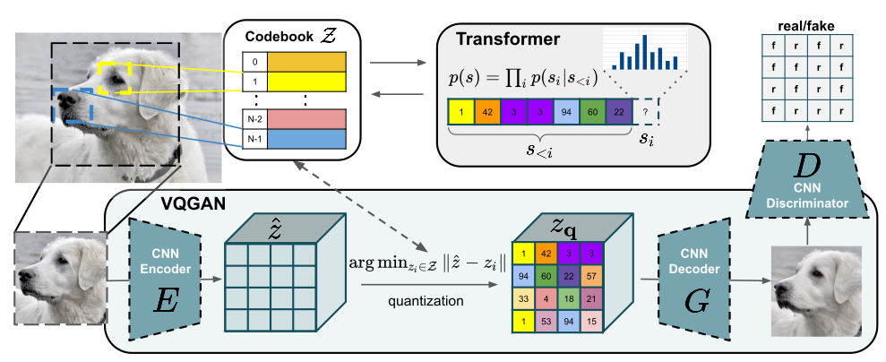
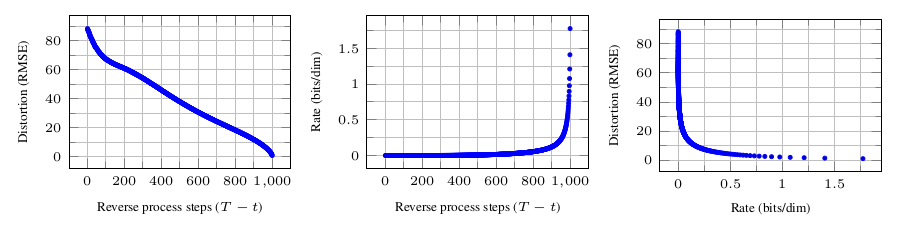

## VQGAN && LDM(latent diffusion model)

### ***Taming Transformers for High-Resolution Image Synthesis***

> in contrast to CNNs, transformers contain no inductive bias that prioritizes local interactions. this make them expressive, but also computationally infeasible for long sequences. this paper demonstrated how to combine the effectiveness of the inductive bias of CNNs with the expressivity of transformers.

using a convolutional approach to efficiently learn a codebook of context-rich visual parts and learn a model if their global compositions.

the main idea is similar with the VQVAE while the loss is different: 

replace the $L_{2}$ loss by a perceptual loss and introduce an patch-based discriminator D.

and the autoregressive model are replaced by a transformer model.

##### Conditioned Synthesis

when we use additional information $C$ to control the image synthesis we could model 
$$
p(s|c) = \prod_{i}p(s_{i}|s_{<i},c)
$$

### ***High-Resolution Image Synthesis with Latent Diffusion Models***

>DMs allow to suppress this semantically meaningless information by minimizing the responsible loss term, gradients (during training) and the neural network backbone (training and inference) still
>need to be evaluated on all pixels, leading to superfluous computations and unnecessarily expensive optimization and inference

figure from ***DDPM***:

the DM could learn the semantic information quickly while the perceptual information will take longer time to optimized.

the strategy in this paper is to using the VQGAN to precess the perceptual information and the semantic information is coped in diffusion model.

using the encoder in VQGAN to achieve perceptual image compression by  encoding image $x \rightarrow z$

and using diffusion model in the latent space $z$

