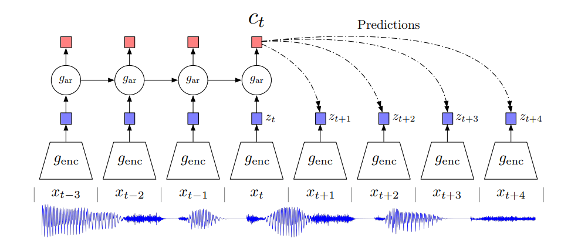

## Representation Learning with Contrastive Predictive Coding (CPC)

> The key insight of our model is to learn such representation by predicating
> the future in latent space by using powerful autoregressive models, which we call
> **Contrastive Predicating Coding**, this is a universal unsupervised learning approach
> to extract useful representations.

#### Methods:
1. compress high-dimensional data into a much more compact latent embedding 
space in which conditional predictions are easier to model.
2. using autoregressive models in this space to make predictions many steps in future.
3. rely on `Noise-Contrastive Estimation` for the loss function

#### Motivation and Intuitions
Approaches that use next step prediction exploit the local smoothness of the signal. 
When predication further in the future, the amount of shared information becomes much lower,
and the model needs to infer more global structure.

unimodal losses such as meansquared error and cross-entropy are not very useful

#### Architecture

> we do not predict future observations $x_{t+k}$ directly with a generative model
> instead we model a density ratio which preserves the mutual information between x_{t+k} and c_{t}
> Both the encoder and autoregressive model are trained to jointly optimize a loss based on NCE