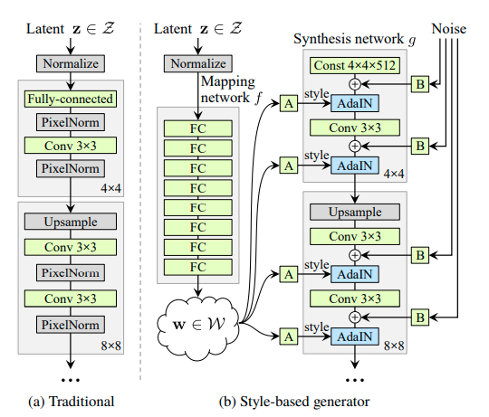
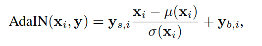
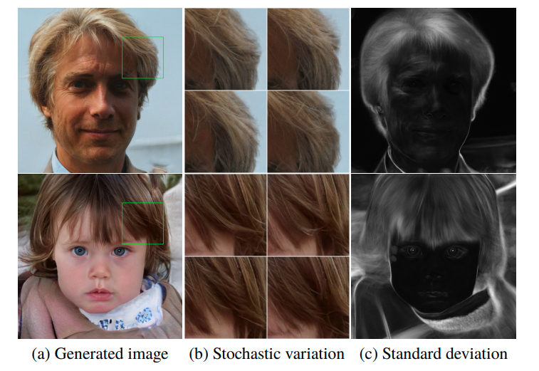
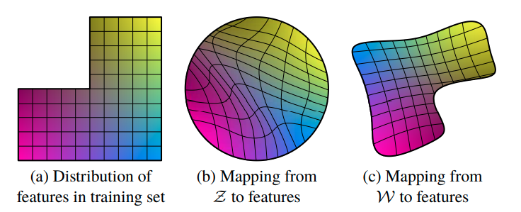

## StyleGAN

> Arbitrary style transfer in real-time with adaptive instance normalization.
>
> 需要阅读以上文献

从特征转移的文献提出了一种新型的GAN 结构，可以无监督自动地学习在生成图片中将高级别特征与随机变量分离开来。

同时为了更好的量化插值质量和解纠缠，文章提出了两种新型的自动评估方法适用于任何生成模型。另外生产出来了一个高质量的数据集。

 同时文章没有改变传统GAN的架构和loss 以及超参数

> We do not modify the discriminator or the loss function in any way, and our work is thus orthogonal to the ongoing discussion about GAN loss functions, regularization, and hyper-parameters

文章认为 中间层的隐变量空间相比输入空间可以更好的实现解纠缠

> The input latent space must follow the probability density of the training data, and we argue that this leads to some degree of unavoidable entanglement

首先 StyleGAN 增加了一个由MLP组成的mapping network 生成 $w$ 也就是intermediate latent space

然后由“A”代表的学习的affine transform   而B代表在channel维度上对noise 的scale factor

AdaIN操作定义如下：

 

$Y$ 是style 变量 在每个channel 维度上控制X的表达 

$y$ 是从$W$ 中学习到的而不是从example image中

Quality of generated Image 通过FID 来衡量, 没有使用**truncation trick**

### **style generator 的特点**

可以让style 在network localize

1. **mixing regularization** 

style generator 还使用了 mixing regularization 的技术 在训练的过程中 一定比例的图片使用两个隐变量生产 每个变量分别控制一部分style 这样的好处是进一步促进style to localize

为了让input之中表达不同特征之间的信号在网络中局域化 而用的trick  这个正则化强化信号特征正交化

2. **Stochastic variation**

对于人像中的随机变量 如头发位置 胡须 皮肤毛孔 只要服从正确的分布  那么都不会影响人的感知

考虑传统的gan 中生成器 需要从input当中生成这些伪随机的变量 在任何需要的时候，这消耗模型的容量并且隐藏信号的周期性是困难并且大多数时候是不成功的

这段话的意思是 人脸分布中的某些分布是独立的 和人的姿势 身份 等高级特征不相关 因此是随机的, 所以从同一个input中去生成多个不相关的分布 不那么make sense 因此 可以input分为多个部分  在architecture中就是noise

仅改变模型中 的noise 可以只改变 头发上的细微变化 并不影响主体 通过100张图片每个像素点的方差可以看到头发 背景 受noise控制

##### Separation of global effects from stochasticity

global can be controlled coherently because the style affects the entire image by complete feature maps are scaled and biased with the same values 

但是noise 是互相独立的加入到像素值中的 并且noise之间也是独立的 

这一段主要讲 style之间是coheretly 以及原因 来自同一个input  而细节是独立的 因为noise是相互独立且应用到了像素层面

**Disentanglement studies**

> definitions for disentanglement: a common goal is a latent space that consists of linear subspaces, each of which controls one factor of variation.

从中间层空间$W$ 中去实现解纠缠更加合适 因为没有附加约束

但是传统的解纠缠需要一个encoder去实现一个相反的映射 这个架构并不合适传统的GAN 因此这篇文章提出了两种衡量解纠缠的方法

在latent space中去进行interpolation 可能会在image中出现令人吃惊的非线性变化

### Style GAN 实际训练trick

affine transform  也就是style 学习的部分 学习率和generator部分不一样 需要设置的小一点

同时在generator 的学习过程中 使用accumulate function 实现EMA  让训练变得更加稳定 (using moving average of parameters is often useful for performance of neural nets, which used in big gan progressive gan )

在github 热门的style gan 的实现中 loss 选择了 wgan-gp 以及 R1 

其中R1 loss 来自Which Training Methods for GANs do actually Converge? 这篇文章

However, it is known that drawing latent vectors from a truncated [38, 4] or otherwise shrunk [31] sampling space tends to improve average image quality, although some amount of variation is lost.

