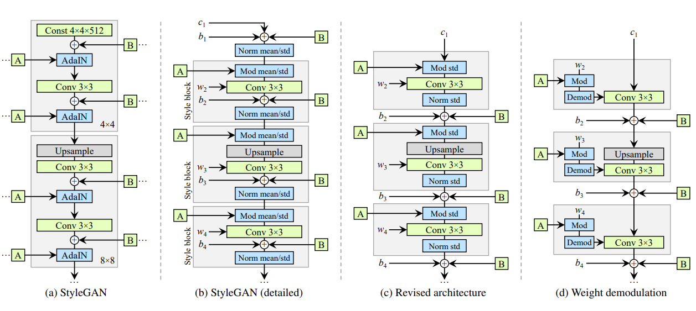
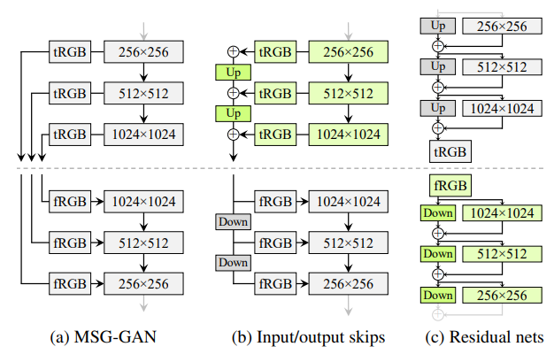
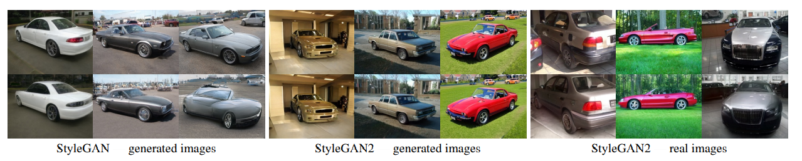

### StyleGAN2

***Characteristic artifacts in StyleGAN***

*the reason*

> AdaIn operation that normalized the mean and variance of each feature map separately, thereby potentially destroying any information found in the magnitudes of the features relative to each other.
>
> by creating a strong, localized spike that dominats the statistic, the generator can effectivcely scale the signal as it likes anywhere

*how to resolve*

Instance normalization revisited

the main idea is to remove the normalization operation in generator

> Furthermore, we notice that after this change it is sufficient for the normalization and modulation to operate on the standard deviation alone (i.e., the mean is not needed).

***PPL as a metric to indicate the Image quality***

> PPL, a metric that was originally introduced for quantifying the smoothness of the mapping from a latent space to the output image by measuring average LPIPS distances between generated images under small perturbations in latent space.

***Lazy regularization is work***

> no harm is caused when R1 regularization is performed only once every 16 minibatches

***Path Length regularization***

> $w$ gradients: these gradients should have close to an equal length regardless of w or the image-space direction, indicating that the mapping from the latent space to image space is well-conditioned

***Progressive growing revisited***

> the key issue is that the progressively grown generator appears to have a strong location preference for details

**using a skip generator and a residual discriminator is a powerful combination.**

***projection of images to latent space***

> concentrate on finding latent codes in the original, unextended latent space, as this correspond to images that the generator could have produced

*method*:

1. add ramped-down noise to the latent code
2. optimize the stochastic noise inputs of the StyleGAN generator, regularizing them to ensure they do not end up carrying coherent signal.

*highlights ability:*

> being able to attribute a fake image to its specific source

