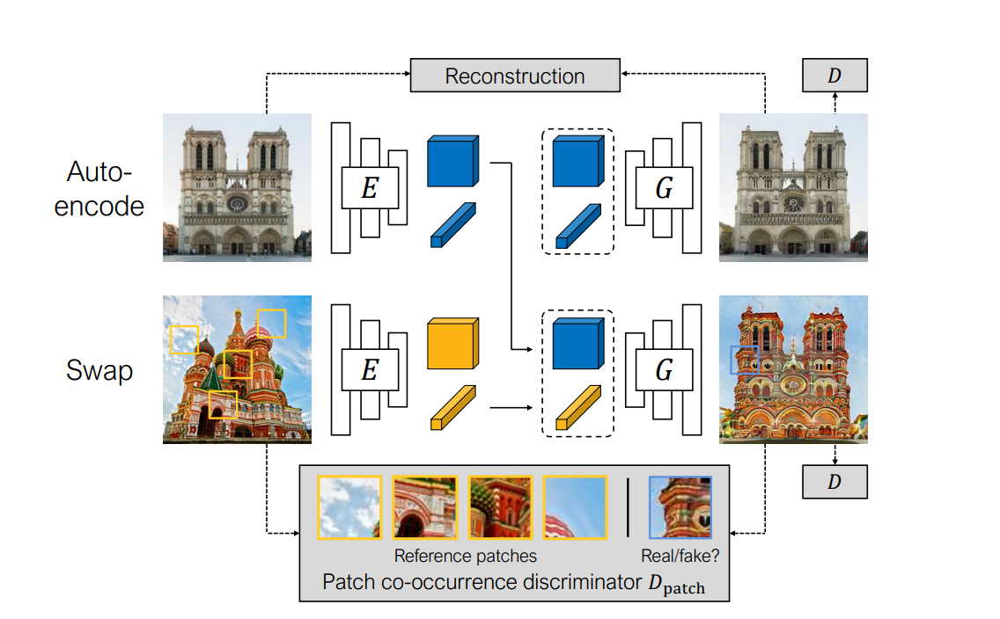

## Swapping Autoencoder for Deep Image Manipulation

this paper is similar with LORD, which is also extract two independent information from image: style and content.

the difference is the LORD is class-supervised model with prior knowledge. the variation intra-class is bigger than inter-class. using latent optimization to get the latent code for train images, and learning a mapping from image to latent code at second stage.

the swapping autoencoder is training two encoders to get latent code. which is more straight forward than LORD.

the first question in learning-driven image manipulation is:

> what information should be gleaned from the dataset versus information that must be retained from the input image

 

compare with the majority of recent deep generative models, this model do not enforce such constraint to the latent space. 

how co-occurrence discriminator works?

> concatenate the feature of each patches and pass to final classification layer 

the most interesting part is:

> even though no explicit constraint was enforced on the latent space, we find that modifications to the latent vectors cause smooth and predictable transformations to the resulting images.