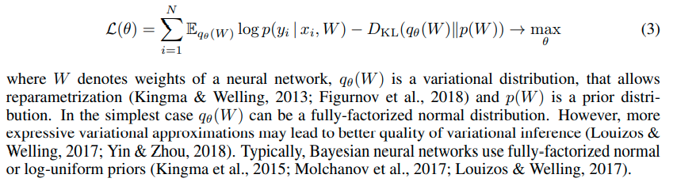
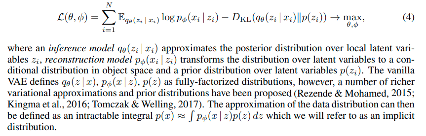

### The Deep Weight  Prior

文章定义一种隐式分布为dwp 表示cnn网络权重的先验，然后在这样的隐式先验的条件下进行变分推断

问题1 什么是dwp 如果是指的卷积核的先验 如何和变分推断挂钩 变分推断里面重要的是 隐变量的先验

问题2 dwp is implicit prior, how to use in variational inference?

首先 变分推断：
$$
\mathcal{L}(\theta) = L_{D} - D_{KL}(q_{\theta}(w)||p(w)) \rightarrow  max_{\theta}
$$

$$
   L_{D} = E_{q_{\theta}(w)}logp(D|w)
$$

Bayes deep learning 有 两个应用方向 

第一个方向是 Bayesian Neural Networks 

stochastic gradient variational bayes framework has been applied to approximate posterior distributions over parameters of deep neural network

consider a discriminative problem, where data D consist of N Object-label pairs $\mathcal{D} = {(x_{i},y_{i})}_{i=1}^{N}$

第二个方向就是 variational auto-encoder

从以上两个公式可以看出 在贝叶斯视角下 虽然 隐变量和模型参数都是 变量，但他们之间最大的不同点依然是 参数和样本是独立的 但是隐变量和样本是不独立的

下面开始介绍 什么 deep weight  prior

