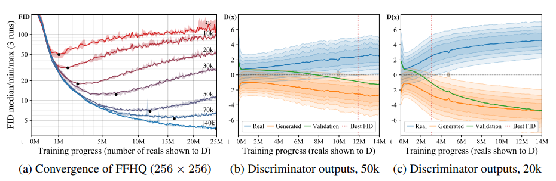
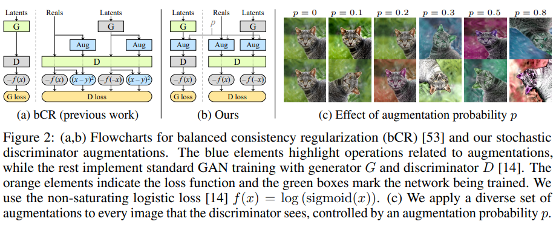
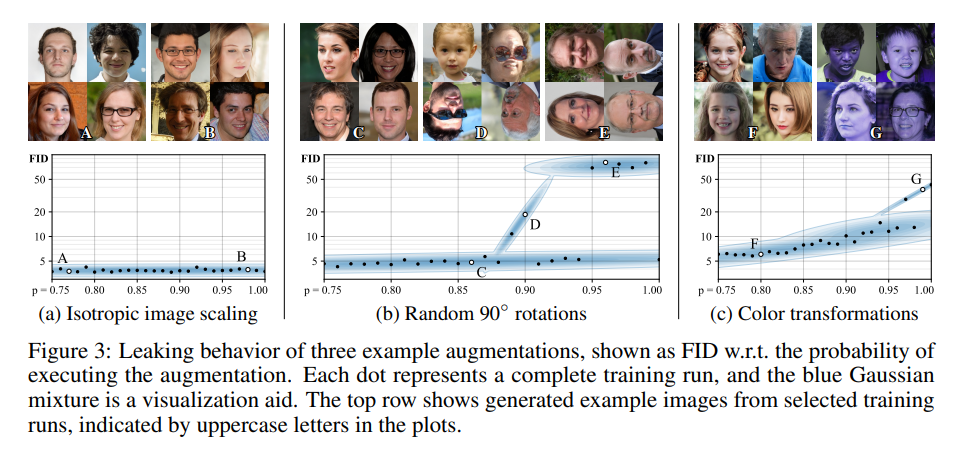

### Training Generative Adversarial Networks with Limited Data

> too little data will lead to discriminator over-fitting, causing training to diverge

***an adaptive discriminator augmentation mechanism***

> how to use a wide range of augmentations to prevent the discriminator from overfitting, while ensuring that none of the augmentations leak to the generated images.

***how the quantity of available training data affects GAN training?***

a. *measure quality by computing FID between 50k generated images and all available training images, regardless of the subset actually used for training.*

b/c. *the distributions overlap initially but keep drifting apart as the discriminator becomes more and more confident, and the point where FID starts to deteriorate is consistent with the loss of sufficient overlap between distributions.*

***employ versatile augmentations that prevent the discriminator from becoming overly confident***

> balanced consistency regularization (bCR) will leak augmentation to generated images

> In training GANs under corrupted measurements, and show that the training implicitly undoes the corruptions and finds the correct distribution, as long as the corruption process is represented by an invertible transformation of probability distributions over the data space. 

--- ***AmbientGAN***

The power of these invertible transformations is that they allow conclusions about the equality or inequality of the underlying sets to be drawn by observing only the augmented sets. 

***Augmentation that do not leak***

