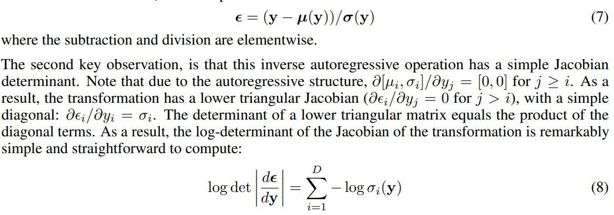

## VAE-IAF

> Improved Variational Inference with Inverse Autoregressive Flow

[TOC]

normalizing flows provides a general strategy for flexible variational inference of posterior over latent variables

propose a new type of normalizing flow, inverse autoregressive flow (IAF)

advantage: scale well to high dimensional latent spaces

in addition, demonstrate a novel type of variational autoencoder, couple with IAF 

#### 

#### 什么是normalizing flows

从一个简单的已知PDF分布$z_{0}$出发 应用链式的可逆转换$f_{t}$ 最终可以得到一个复杂的分布$z_{t}$
$$
z_{0} \sim q(z_{0}|x), z_{t} = f_{t}(z_{t-1},x)
$$
只要$f_{t}$的jacobian determinant 可以被计算 那么依然可以计算$z_{t}$的概率密度函数

之前应用在VAE中的normalizing flow 的转换相对简单
$$
f_{t}(z_{t-1}) = z_{t-1}+\mu h(w^{T}z_{t-1}+b)
$$

#### Inverse Autoregressive Transformations

autoregressive model的代表是MADE 和Pixel CNN

从高斯分布$\epsilon \sim N(0,I)$ 经过自回归生成向量$y$ 
$$
y:y_{0} = \mu_{0} + \sigma_{0}\cdot\epsilon_{0}\hspace{1cm} y_{i} = \mu_{i}(y_{1:i-1})+\sigma_{i}(y_{1:i-1})\cdot\epsilon_{i}
$$

由于VAE 需要在后验分布中采样 而autoregressive模型是迭代式的 并且和向量的维数成正比

> computation involved in this transformation is clearly proportional to the dimensionality D

但其实 在VQ-VAE中就使用了

但是从$y$到$\epsilon$的逆变换是可以并行 并且雅各比行列式 是简单的

因此上述自回归的逆变换 就是一种normalizing flow

#### Inverse Autoregressive Flow

