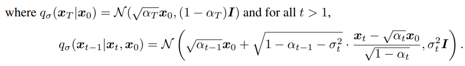
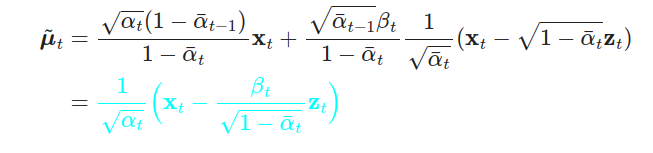
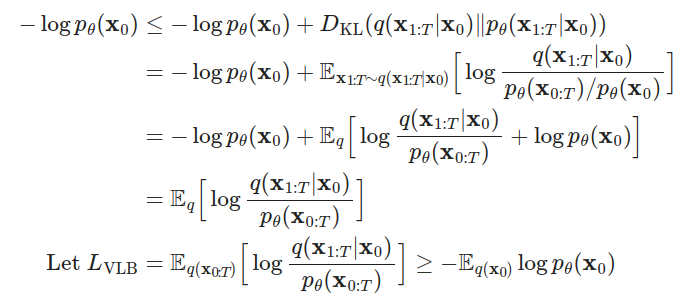
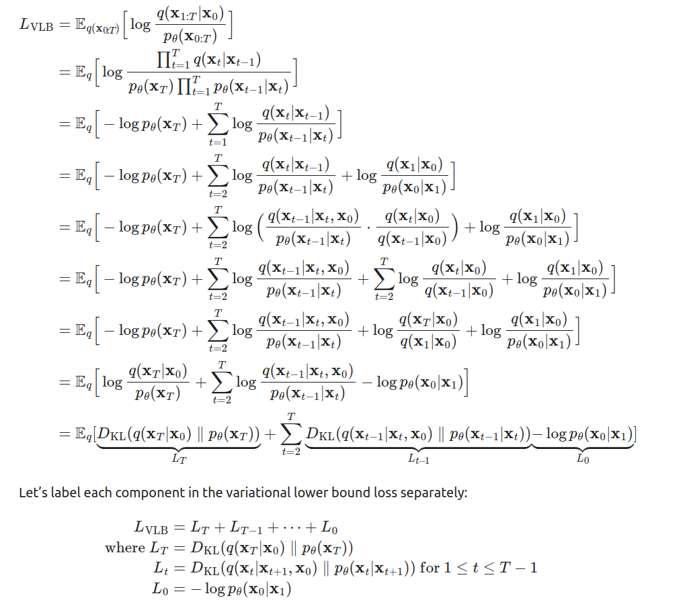
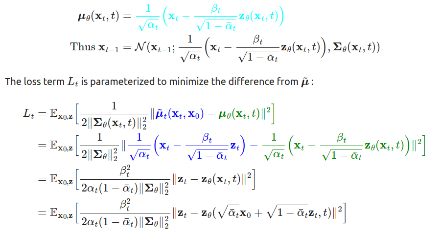
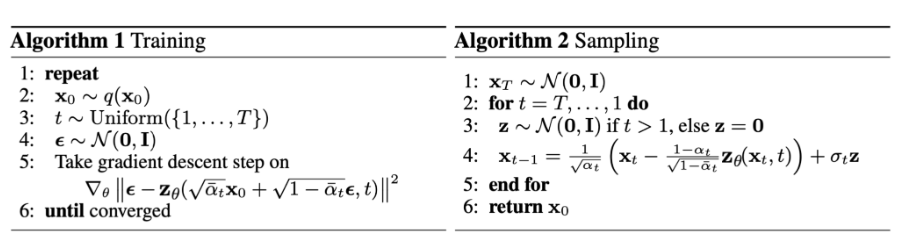

## Diffusion Model

> https://huggingface.co/blog/annotated-diffusion
>
> https://lilianweng.github.io/posts/2021-07-11-diffusion-models/

there are several models based on Denosing Diffusion Probabilistic Models
- GLIDE
- DALL-E 2
- Latent Diffusion
- ImageGen

DDPMs is a neural network learning to gradually denosing data strating from noise

the set-up consists of 2 processes:
- a fixed forward diffusion process $q$, that gradually adds Gaussian noise to an image, until you end up with pure noise
- a learned reverse denosing diffusion process $p_{\theta}$, where a neural network is trained to gradually denoise an image starting from pure noise, until you end up with an actual image

### Mathematical form 

Let $q(x_{0})$ be the real data distribution, real images, we can sample from this distribution to get an image,

$x_{0} \thicksim q(x_{0})$ we define forward diffusion process $q(x_{t}|x_{t-1})$ which adds Gaussian noise at each time step $t$, according to a known variance schedule $0< \beta_{0}<\beta_{1}<...<\beta_{T}<1$ 

$$
q(x_{t}|x_{t-1})=N(x_{t};\sqrt{1-\beta_{t}}x_{t-1},\beta_{t}I)
$$

each new (slightly noisier) image at time step $t$ is drawn from a conditional Gaussian distribution 

so starting from $x_{0}$, we end up with $x_{T}$ where $x_{T}$ is pure Gaussian noise if we set the schedule appropriately. (the process can be viewed as a markov chain)

a nice property is that we can sample $x_{t}$ at any arbitrary time step $t$ in a close form using reparameterization trick. Let $a_{t} = 1-\beta_{t}$ and $\overline{a}_{t}=\prod_{i=1}^{T}{a_{i}}$
$$
x_{t}= \sqrt{a_{t}}x_{t-1}+\sqrt{1-a_{t}}z_{t-1}
\\= \sqrt{\overline{a}_{t}}x_{0}+\sqrt{1-\overline{a}_{t}}z
\\ q(x_{t}|x_{0}) = N(x_{t};\sqrt{\overline{a}_{t}}{x_{0}},(1-\overline{a}_{t})I)
$$

if we knew the conditional distribution $p(x_{t-1}|x_{t})$ then we can run the process in reverse and get the $x_{0}$ finally. while it is intractable, as it requires knowing the distribution of all possible images.

fortunately, we can use the Bayes' rule to get the reverse conditional probability when conditioned on $x_{0}$:

using the nice property we have:

assume we have a generative model, we need maximize the likelihood of  real data $x_{0}$

we can use variational lower bound to optimize the negative log-likelihood

so we need to minimize the $L_{VLB}$ to optimize the parameterized model

we need to learn  a neural network to approximate the conditioned probability distributions in the reverse diffusion process, $p_{\theta}(x_{t-1}|x_{t})=N(x_{t-1};\mu_{\theta}(x_{t},t),\sum_{\theta}(x_{t},t))$

### DDPMs (Denoising Diffusion Probabilistic Models)

the most straightforward parameterization of $\mu_\theta$ is a model that predicts $\widetilde{\mu}_{t}$

we can reparameterize the Gaussian noise term instead to make it predict $z_{t}$ from the $x_{t}$

**DDPM** found training the model works better with a simplified objective that ignores the weighting term.
$$
L_{t}^{simple} = E_{x_{0},z_{t}}[||z_{t}-z_{\theta}(\sqrt{\overline{a}_{t}}x_{0}+\sqrt{1-\overline{a}_{t}}z_{t},t)||^{2}]
$$

### Training and Sampling(DDPMs)

so the training and sampling process could be in **DDPM**

the Algorithm 2 sampling resembles Langevin dynamics $\epsilon_{\theta}$ as a learned  gradient of the data density

### Neural network

the neural network need to take in a noised image at a particular time step and return the predicted noise

note that the noise is a tensor that has the same size as the input image

DDPM use the U-Net architecture, this architecture like any autoencoder and introduced residual connections between the encoder and decoder, greatly improve the gradient flow

### Connection between diffusion probabilistic models and denoising score matching with Langevin dynamics

 